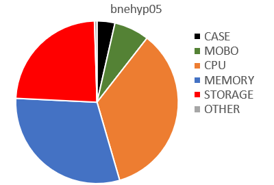
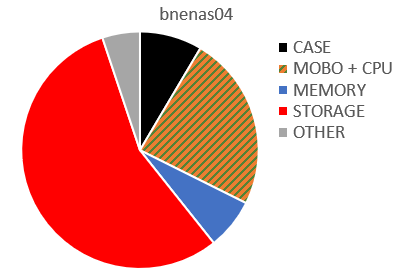
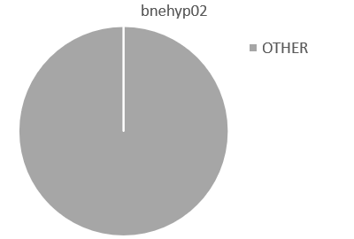
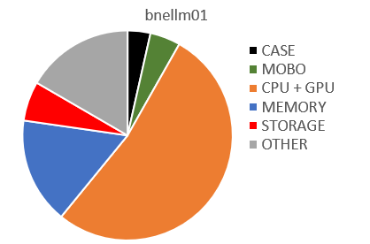

# bookcase-ops hardware

So these are the bits of kit I'm configuring with this project:

Edit 2026-10-06: I've added an outrageously expensive server I've going to use for LLMs ( bnellm01 ) 

# The bookcase

It's metal and it's got 5 shelves on it.

# bnehyp05

The hypervisor, for running virtual machines and containers. 

* Cooler Master MT Case N200, $63.00
* B360M-PRO-VDH mobo, $123.70 ( amazon )
* Intel Core i7 8700K Six Core LGA 1151 3.7 GHz CPU Processor, $619.00
* G.SKILL Ripjaws V Series 64GB (4 x 16GB) 288-Pin DDR4 SDRAM DDR4 2800 (PC4 22400) Desktop Memory Model F4-2800C14Q-64GVK, $536.00 ( newegg )
* Thermaltake Litepower 500W OEM ATX PSU, $45.00
* Thermaltake Contac Silent 12 CPU Cooler - AM4 Support, $45.00
* Samsung 2TB 860 QVO 2.5in SATA SSD, $330.00
   * think I put an old spinning rust SATA drive in here as well which I use for occasional backups 
* Logitech M90 Optical Mouse, $9.00

Total: 1770.70 

# bnenas04

A ZFS storage server, running TrueNAS SCALE ( based on Linux, which is a step up from my earlier nas servers which ran on FreeNAS/FreeBSD ). 

Everything below is from umart.com.au, unless mentioned otherwise.

* SilverStone Black DS380 8 Bay Hot Swap SFF Chassis, $249.00 ( mwave.com.au )
* C2750D4I mobo, $697.40 ( wisp.net.au )
   * this was initially a C2550D4I for $608.06 but they didn’t have it in stock, so was forced to upgrade
   * is one of the few motherboards around with a huge number of SATA ports on it. 
     In retrospect maybe I could have gone something cheaper and used some PCIe cards to add some slots instead.
* 4x 8gb SP016GLLTU160N22 DDR3L 1600MHz PC3-12800 1.35V CL11, $178.00
* 8x Seagate Barracuda 8TB ST8000DM004 Desktop 3.5IN HDD, $1,592.00
* Silicon Power A55 256GB TLC 3D NAND 2.5in SATA III SSD, $33.00
   * for the boot drive. You used to be able to run FreeNAS off a usb stick, but that's not supported for TrueNAS.
* Cooler Master V 550W 80+ Gold SFX Power Supply, $134.00
* Generic Internal USB 2.0 (MB-F) to USB3.0 19pin Adaptor Cable, $3.00
* Intel Optane Memory 16 GB $24.99 ( ebay )
   * for the ZFS SLOG
* PCIE to M2/M.2 Adapter PCI Express X4 X8 X16 NVME M.2 SSD PCIE Expansion Card , $12.99 ( ebay )
   * so that I could fit the optane memory in there

You need that SLOG by the way, otherwise NFS runs slower than a 3600 baud modem for some tasks.

Those 8 drives are configured in a raidz2 volume, so 2 of them provide resiliency in the case of hardware failures.

Total: 2924.38

Update 2026-10-06: OK so at some point in 2024 or 2025, the drives in an older box ( `bnenas03` ) died, 
so I bought some bigger disks and shoved them in there, relabelled it as `bnenas05`, and that became the primary NAS.

I've updated most of the refs in this project to point to that instead. 

# bnehyp02

An older hypervisor that is also running bind9 and isc-dhcp-server

* DELL PRECISION T1600, XEON E31245 (3.3 GHZ), 16 GB, 1 TB $420 ( ebay )
   * Got this back in 2017 and it's mostly retired from active duty   

Total: 420.00

# That's it ?

No, because I went and bought another server to use for LLMs:

# bnellm01

A relatively new server purchased 2026, which I'm going to use to run LLMs because that's the hot new thing.

Picked this up from mikepc ( the "Chinook AI Max PC" ), as they're capable of building PCs with multiple GPU cards. 
Prices below are approximate as I didn't get an itemised bill. 

What it's got:

* CPU: Ryzen 9-5900X CPU ( 12C/16T - 4.80Ghz Boost ), ~ $500
* GPU: 2 x MSI RTX 3090 Aero ( 48GB G6X total ), ~ $4000. 
   * They're "blower" style GPUs which is what you want in a multi-GPU box as they vent air outside the chassis instead of directly into the other card.
* Mobo: Asus Pro WS X570-ACE , which has enough very-distantly-spaced PCIe slots that I can jam another 3090 card in here later on perhaps, ~ $400
* Power supply: Corsair HX1500i 1500W, which can also power that if necessary, ~ $390
* RAM: 128GB DDR4 ; 4x32GB, ~ $1400
* Main OS storage: 1TB NVMe Gen 3 M.2 SSD, ~ $230
* Data storage: 2TB NVMe Gen 4 M.2 SSD, ~ $290
* Putting it together, maybe ~ $500 ?

Total: about 8 grand.

The cost of everything in this box is outrageous, because anthropic et al are purchasing GPUs, RAM and SSDs like you wouldn't believe. 
Due to the kind of inverse Moore's Law that we're living in in 2026, this would have cost about half as much if I'd got it last year.

Also, due to the fact that this thing is enormous, it doesn't live in the bookcase, it sits over there in the opposite corner.

Somewhat alarmingly, every third time I turn it on I get an amber light on the mobo and it doesn't boot up. Seems ok after I powercycle though. 
The Asus website tells me that's possibly due to incorrectly seated RAM, but I've checked those and run some memtest86 tests and apparently it's fine.

So let's see how that all pans out.

# That's it ?

Yep. Well, there's a network switch, and a KVM attached to an old monitor/keyboard, and some other miscellaneous crap, but the boxes listed above is what this particular project is configuring. 

