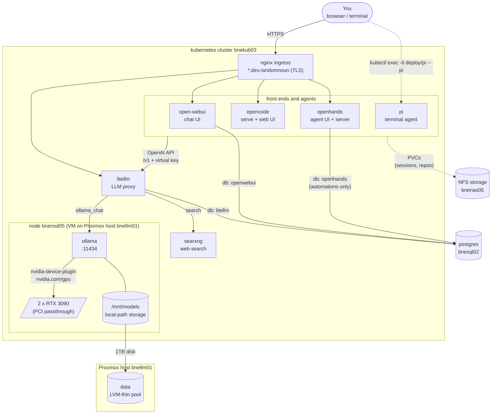

# bookcase-ops LLM setup

A maze of twisty components, all of which are alike:



Nothing but `litellm` talks to `ollama`; everything else goes through litellm's API, using its own virtual key.
 
Only `ollama` is pinned to `bnenod05` ( it needs the GPUs and the model disk ). 

### Steps

OK so first you'll need to install **proxmox** on the new `bnellm01` machine that has the GPUs in it - see [SETUP-PROXMOX.md](SETUP-PROXMOX.md).

Then:  

* Create the `tpl-ubuntu-kubernetes-node` VM template via packer. See [../packer-ubuntu-kubernetes-node/README.md](../packer-ubuntu-kubernetes-node/README.md).
* Clone that to create the `bnenod05` kubernetes node; it'll join the `bnekub03` cluster
* Attach the GPUs to `bnenod05`
* Start installing the containers 

### Kubernetes node on proxmox

Check the [packer-ubuntu-kubernetes-node/README.md](packer-ubuntu-kubernetes-node/README.md) on how to configure it, from that folder you'll need to run 

```
build.sh proxmox
```

to create the `tpl-ubuntu-kubernetes-node` template. 

Clone and rename it to create `bnenod05`, start it, and join the cluster by running ` /opt/backup/join-command/kubernetes-join-command.sh`

If you need to regenerate the token, from `bnekub03`, run `kubeadm token create --print-join-command`

If starting the node appears to crash the host (including proxmox), try decreating the memory allocation a bit

### Attach GPUs to bnenod05

Via the Proxmox UI:

1. Shut down bnenod05 first (hardware changes require the VM to be off).
2. Select bnenod05 → Hardware tab → Add → PCI Device.
3. Choose Raw Device, select 0a:00 from the dropdown (it'll show as the RTX 3090).
4. Tick All Functions — this passes through both the VGA (0a:00.0) and audio (0a:00.1) parts together as one unit, which is what you want (they're logically one card).
5. Tick PCI-Express — needed since we built the template on q35, which uses the PCIe bus (not legacy PCI).
6. Leave Primary GPU unticked — that's for cases where the VM needs the card for its own console/display; bnenod05 is headless and uses the regular Proxmox serial/VNC console, so the 3090s are purely compute devices here.
7. Click Add, then repeat the same for 0b:00 (the second card) as a second PCI Device entry.
8. Boot bnenod05.

Equivalent via CLI, if you'd rather:
qm set <vmid> --hostpci0 0a:00,pcie=1
qm set <vmid> --hostpci1 0b:00,pcie=1

After boot, inside the guest:
lspci -nnk | grep -i nvidia
nvidia-smi
lspci should show both cards now bound to the nvidia driver (the one we baked into the template earlier), and nvidia-smi should list both RTX 3090s with their VRAM.

### Attach a model storage disk to bnenod05

The second SSD on bnellm01 is there to hold LLM models; carve out a dedicated thin-provisioned disk to hold these models.

The disk will be mounted as `/mnt/models` on `bnenod05`.

The `local-path-provisioner` ansible role will provision ollama's PVC here. 

Create the disk attached to the VM (shutdown the VM first):

```
root@bnellm01:~# qm list
      VMID NAME                       STATUS     MEM(MB)    BOOTDISK(GB) PID
       100 bnenod05                   running    98304             97.66 3828
      9000 tpl-ubuntu-kubernetes-node stopped    122880            97.66 0

root@bnellm01:~# qm set 100 --scsi1 data:1024   # 1TB, thin-provisioned - only consumes real pool space as it's written to
update VM 100: -scsi1 data:1024
  Logical volume "vm-100-disk-0" created.
  Logical volume data/vm-100-disk-0 changed.
scsi1: successfully created disk 'data:vm-100-disk-0,size=1T'
```

Then inside bnenod05:

```
knoxg@bnenod05:~$ lsblk  # confirm the new disk shows up
NAME   MAJ:MIN RM  SIZE RO TYPE MOUNTPOINTS
sda      8:0    0 97.7G  0 disk
├─sda1   8:1    0    1G  0 part /boot/efi
└─sda2   8:2    0 96.6G  0 part /var/lib/kubelet/pods/425b91c1-2ae5-4cae-be5d-8376735bde4c/volume-subpaths/tigera-ca-bundle/calico-node/7
                                /var/lib/kubelet/pods/e6dcb366-64dc-493d-ab3c-c1f0cbf2bcf0/volume-subpaths/tigera-ca-bundle/calico-typha/1
                                /
sdb      8:16   0    1T  0 disk

knoxg@bnenod05:~$ sudo parted /dev/sdb --script mklabel gpt mkpart primary ext4 0% 100%
knoxg@bnenod05:~$ sudo mkfs.ext4 /dev/sdb1
mke2fs 1.47.0 (5-Feb-2023)
Discarding device blocks: done
Creating filesystem with 268434944 4k blocks and 67108864 inodes
Filesystem UUID: 570ba723-ae5c-4abe-94bd-c1b63c903fe7
Superblock backups stored on blocks:
        32768, 98304, 163840, 229376, 294912, 819200, 884736, 1605632, 2654208,
        4096000, 7962624, 11239424, 20480000, 23887872, 71663616, 78675968,
        102400000, 214990848

Allocating group tables: done
Writing inode tables: done
Creating journal (262144 blocks): done
Writing superblocks and filesystem accounting information: done

knoxg@bnenod05:~$ sudo mkdir -p /mnt/models
knoxg@bnenod05:~$ sudo mount /dev/sdb1 /mnt/models

knoxg@bnenod05:~$ sudo blkid /dev/sdb1   # get the UUID for fstab
/dev/sdb1: UUID="570ba723-ae5c-4abe-94bd-c1b63c903fe7" BLOCK_SIZE="4096" TYPE="ext4" PARTLABEL="primary" PARTUUID="22899cf8-184d-43b9-99d8-253196dd0e10"

knoxg@bnenod05:~$ echo 'UUID=570ba723-ae5c-4abe-94bd-c1b63c903fe7  /mnt/models  ext4  defaults  0  2' | sudo tee -a /etc/fstab
UUID=570ba723-ae5c-4abe-94bd-c1b63c903fe7  /mnt/models  ext4  defaults  0  2

knoxg@bnenod05:~$ sudo mount -a
knoxg@bnenod05:~$ df -h /mnt/models
Filesystem      Size  Used Avail Use% Mounted on
/dev/sdb1      1007G   28K  956G   1% /mnt/models
```

### Kubernetes deployments

And then jump over to [ansible/README.md](ansible/README.md) and get some containers running on the node.

I've created them in this order:

* litellm
   * and create a user in the web UI
* searxng
   * then configure searxng in litellm
* ollama
   * then install a few models in ollama
   * then configure those models in litellm
* open-webui
   * will connect to litellm (not ollama directly), create a litellm key first
* pi
   * will connect to litellm (not ollama directly), create a litellm key first
* opencode
   * will connect to litellm (not ollama directly), create a litellm key first
* openhands   
   * will connect to litellm (not ollama directly), create a litellm key first
   
### litellm

So to get this running the first time ( and then again any time it upgrades ), you'll need to do a 'prisma' schema update, via:

```
C:\Users\knoxg>kubectl -n dev-litellm exec -it litellm-c5778658b-7pv4b -- bash
bash-5.3# cd /app
bash-5.3# prisma db push --schema schema.prisma --accept-data-loss
prisma:warn Prisma doesn't know which engines to download for the Linux distro "wolfi". Falling back to Prisma engines built "debian".
Please report your experience by creating an issue at https://github.com/prisma/prisma/issues so we can add your distro to the list of known supported distros.
prisma:warn Prisma doesn't know which engines to download for the Linux distro "wolfi". Falling back to Prisma engines built "debian".
Please report your experience by creating an issue at https://github.com/prisma/prisma/issues so we can add your distro to the list of known supported distros.
Prisma schema loaded from schema.prisma
Datasource "client": PostgreSQL database "litellm", schema "public" at "bnesql02.dev.randomnoun:5432"

🚀  Your database is now in sync with your Prisma schema. Done in 456ms

Running generate... (Use --skip-generate to skip the generators)
command terminated with exit code 137
```

Once it's running:

* Create a team ( 'randomnoun' )
* Create a user

If you're me, then setup some byzantine structure to be able to use the LLMs that are hidden behind your work VPN, 
but that's not the sort of thing you're going to describe in a public-facing repository. 

### ollama 

Unlike the other apps here, `ollama` is pinned to `bnenod05` (`nodeSelector: gpu-vendor=nvidia`) and requests both GPUs (`nvidia.com/gpu: 2`).
Ollama needs the `nvidia-device-plugin` and `local-path-provisioner` system components to be installed, and has no Ingress/TLS.
It's an internal API consumed by other in-cluster services like `litellm`, so uses a plain `LoadBalancer` Service on its native port (11434).

Once it's runing, download and install models via:

```
kubectl -n dev-ollama exec deploy/ollama -- ollama pull qwen3-coder:30b
kubectl -n dev-ollama exec deploy/ollama -- ollama pull llama3.1:8b
kubectl -n dev-ollama exec deploy/ollama -- ollama pull llama3.3:70b
kubectl -n dev-ollama exec deploy/ollama -- ollama pull deepseek-coder-v2:16b
```

Configure the models these in litellm via:

* Models → Add New Model
   * Provider: **Ollama Chat** ( not plain `Ollama` )
   * Model Name: qwen3-coder:30b
   * LiteLLM Model Name: qwen3-coder:30b
   * API Base: http://web.dev-ollama.svc.cluster.local:11434
   * Try 'test connection' and then save
* Repeat for all models

**A note on context window size:** The context window ( `ollama_context_length` in `ansible/vars/ollama/bnekub03.vars.yml` ) is set to 32768. 

pi and opencode have small prompts and can work with a 8192 length, but openhands sends a 15K+ token prompt. A bigger window costs VRAM for the KV cache. 

`ollama ps` shows the `CONTEXT` and the `PROCESSOR` split for whatever is loaded, if the context window is
too large then the model spills from GPU to the CPU (and is much slower).

**A note on tool usage:** Not all models can run tools; some models that advertise tools are poor at them (e.g. qwen2.5-coder:32b).

`ollama show <model>` lists `tools` under `Capabilities` for the models with tool capabilities:

```
kubectl -n dev-ollama exec deploy/ollama -- ollama show deepseek-coder-v2:16b
```

A session that has already gone wrong can keep going wrong. If an earlier reply in the conversation showed a tool call as text, the model tends to copy that
pattern even after you switch to a model that handles tools fine. Start a new session ( `/new` in pi ) before concluding a model doesn't work.

To check a model, ask for a tool call with streaming on, and look for `"tool_calls"` in the chunks ( not JSON inside `"content"` ):

```
KEY=<a litellm virtual key>
kubectl -n dev-litellm run toolcheck --rm -i --restart=Never --image=curlimages/curl -- \
  curl -sN http://web.dev-litellm.svc.cluster.local:4000/v1/chat/completions \
  -H "Authorization: Bearer $KEY" -H "Content-Type: application/json" \
  -d '{"model":"qwen3-coder:30b","stream":true,"messages":[{"role":"user","content":"list the files in the current directory"}],"tools":[{"type":"function","function":{"name":"bash","description":"run a shell command","parameters":{"type":"object","properties":{"command":{"type":"string"}},"required":["command"]}}}]}'
```

### open-webui

A chat frontend for ollama's models, but it talks to `litellm` rather than `ollama` directly 
( `OPENAI_API_BASE_URL=http://web.dev-litellm.svc.cluster.local:4000/v1`, `ENABLE_OLLAMA_API=false`). 

Before you create, will need a litellm key stored in vault, see [SETUP-DATABASE.md](SETUP-DATABASE.md) for details.

### pi

Needs a litellm key in vault, see [SETUP-DATABASE.md](SETUP-DATABASE.md).

[pi](https://pi.dev) is an interactive terminal agent rather than a server, so the `pi` role has no Service, Ingress or certificate; 
it's just a long-lived pod that you shell into, so the agent runs in the cluster rather than on your laptop:

```
kubectl -n dev-pi exec -it deploy/pi -- pi
```

There's no published pi image, so the pod starts from `node:24-bookworm-slim` and installs pi ( plus git and ripgrep ) on startup, 
following the [Dockerfile in the pi docs](https://pi.dev/docs/latest/containerization). It takes a minute or so after each pod restart before `pi` is on the path;
`pi_version` is pinned in the vars file so a restart doesn't pick up a new release. 

At startup, if fetches the list of models from litellm. To pick up a model you've added to litellm since, run this, then open `/model` in pi ( which reloads the file ):

```
kubectl -n dev-pi exec deploy/pi -- pi-sync-models
```

Projects live in `/workspace` and sessions in `/root/.pi/agent`, both on the same 100Gi PVC. pi has no database option, so no postgres.

### opencode

Needs the litellm key and server password in vault, see [SETUP-DATABASE.md](SETUP-DATABASE.md).

Accessible at `https://opencode.dev.randomnoun`. 

Is backed by a PVC instead of a database. The API is protected by HTTP basic auth ( user `opencode`, password from vault ).

opencode can't discover models, so the pod builds its model list from litellm's `/models` endpoint when it starts. 
To pick up a model you've added to litellm since:

```
kubectl -n dev-opencode rollout restart deploy/opencode
```

The same PVC holds the repositories it works on as well as its sessions and auth. The pod's home directory is `/data/workspace`, which is where
the web UI's "Add project" picker starts, so clone repositories straight into it:

```
kubectl -n dev-opencode exec deploy/opencode -- git clone https://github.com/<you>/<repo>.git /data/workspace/<repo>
```

The storage class allows volume expansion, so if that fills up, edit `opencode_volume_size_gb` and re-run the playbook.

The image is `ghcr.io/anomalyco/opencode` and is bare alpine, so the pod installs git, jq and curl on startup.

### openhands

See [SETUP-DATABASE.md](SETUP-DATABASE.md) for the database and vault steps.

OpenHands is now a single all-in-one image ( `ghcr.io/openhands/agent-canvas` ) containing the web UI, the agent server and an automation backend. 
This role is based on the [helm chart](https://github.com/OpenHands/OpenHands/tree/main/helm/agent-canvas) in the OpenHands repo, which upstream describes as experimental. A few things to know:

* The UI is at `https://openhands.dev.randomnoun/canvas` ( the `/canvas` prefix is baked into the image ). The first visit walks you through a short onboarding:
   * **Add a backend:** 
      * Host: `https://openhands.dev.randomnoun` ( no `/canvas` ),
      * Type: `Local`
      * Session key: the session API key from vault: `vault kv get -mount=secret -field=session_api_key k8s/bnekub03/secret/dev-openhands/openhands`
   * **Choose your agent:** 
      * pick **OpenHands**. The choice is per backend, and can be changed under Settings → Agent later
   * **Set up your LLM:** 
      * Choose **Advanced**
      * Custom Model: `openai/qwen3-coder:30b` 
      * Base URL: `http://web.dev-litellm.svc.cluster.local:4000/v1`
      * API Key: the litellm virtual key for openhands ( see [SETUP-DATABASE.md](SETUP-DATABASE.md) )
      
* It turns out you need openhands 'Enterprise' to get the isolation features I was installing this for ( might be able to install docker-in-docker later ) 
* You need to install the tables manually. For postgres it starts OK, finds no tables, and carries on, so chat and coding sessions work but the automation features won't. 
* Create the tables once, and again after bumping `openhands_image`, via:

```
kubectl -n dev-openhands exec -it deploy/openhands -- sh -c '
export AUTOMATION_DB_URL=$(echo "$AUTOMATION_DB_URL" | sed "s#postgresql+asyncpg#postgresql+pg8000#")
python -c "
from alembic import command
from alembic.config import Config
cfg = Config()
cfg.set_main_option(\"script_location\", \"/usr/local/lib/python3.13/site-packages/openhands/automation/migrations\")
command.upgrade(cfg, \"head\")
"'
```

Check it works from bnesql02 via:

```
sudo -u postgres psql -d openhands -c '\dt'
```

Should return 13 tables.

* The PVC holds `~/.openhands` and `~/workspace`, where the agent's repos live.

To check it all works, start a new conversation, and ask it "create a file hello.txt containing 'hi', then list the directory" 
It should write the file and run `ls -la` for real.


