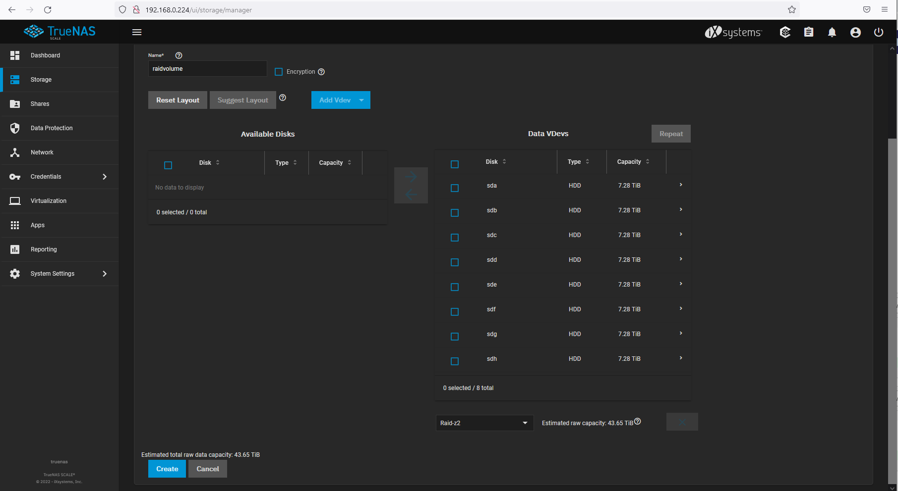
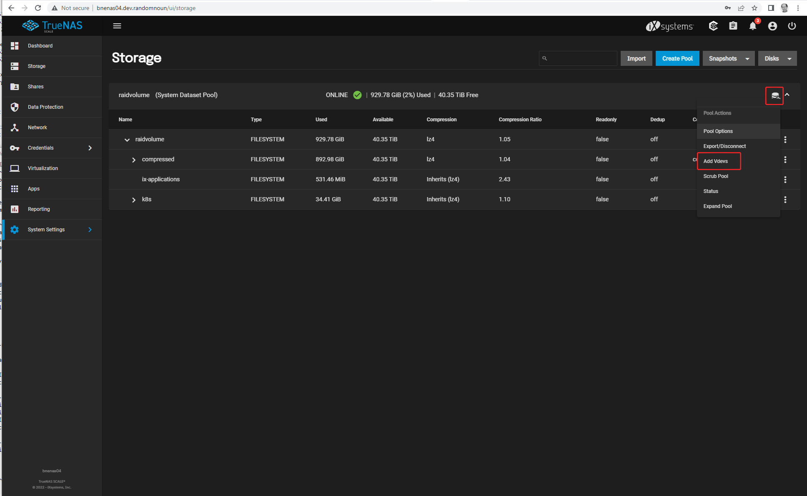

# bookcase-ops NAS

This project has been tested on the free version of [TrueNAS SCALE](https://www.truenas.com/docs/scale/).

TrueNAS is the successor to FreeNAS, and 'TrueNAS SCALE' is the version of TrueNAS that runs on linux, which you are definitely going to prefer to FreeBSD the first time you want to run 
something on there that you need to install yourself. 

The TrueNAS server in this project is called `bnenas04.dev.randomnoun`, so if you want to call it something different then do a search & replace on that.

# Installation

Follow the steps at [https://www.truenas.com/docs/scale/gettingstarted/](https://www.truenas.com/docs/scale/gettingstarted/)

Once you've burnt an ISO onto a USB stick and used it to install the OS, you should be able to login via the web UI to administer the nas, which is when I started taking screenshots of things.

You'll notice the IP addresses and hostnames change in the screenshots below as I didn't do this in the right order, but if I was going to do this again, this is the order I'd do it in.

* The TrueNAS dashboard - hit the 'Check for updates' button to update to the latest

## Create a `raidvolume` pool

* Select 'storage' on the left hand side, then 'Create pool' to create the storage pool:

   
* I've named the pool `raidvolume`, and selected all 8GB disks to comprise the storage, in a raid-z2 formation:
   * raid-z2 burns up two of your drives for ZFS resiliency; it allows up to 2 arbitrary drives in the pool to fail before you incur any data loss.
   * You want raid-z2 because if you bought all your drives at the same time, when they start failing they'll tend to fail at the same time.

## Create some datasets

* Create a dataset within the pool

* I've named the dataset 'compressed' as it will have lz4 compression on by default:

* Within the raidvolume pool, create a `k8s` dataset ( for kubernetes ), then a `bnekub02` dataset within that ( for the bnekub02 cluster ), and an `nfs` dataset within that ( for democratic-csi volumes )
   * I did this a bit later than the other steps, ignore that 'ix-applications' folder.

## Create an SMB share

* Click 'Sharing' on the left hand side and create an SMB share
* I've named the share 'raidvolume' and pointed it to the /mnt/raidvolume folder

* Enable the SMB service

## Enable some more services

* Enable a couple more system services ( SSH and S.M.A.R.T. checks )

* Enable NFS as well
   * Enable NFSv4
   * Enable NFSv3 ownership model for NFSv4

## Create a non-root user

* Create a non-root user; I'm using the username `knoxg`

----

## Adding a SLOG vdev to the pool

So after going through that and setting up the rest of the cluster, I found performance to be pretty dismal - [here's an issue I raised on the democratic-csi github tracker](https://github.com/democratic-csi/democratic-csi/issues/251), with 
some I/O performance stats.

The solution was to add a ZFS SLOG (separate log) drive. 

Here are the steps to do that:

* Under Storage -> Disks, check the disk is appearing. I'm using a small Optane NVMe2 SSD, which various sites tell me survive a power outage more resiliently than non-Optane drives. Which apparently is something you want in a SLOG.

* Hit that icon on the raidvolume pool and select 'Add vdevs' 

* Hit the 'Add Vdev' button up the top and select 'Log'

* Add the drive to the 'Log Vdev' list, select 'Stripe' configuration, check 'Force' and add the vdev. You'll get a few more confirmation warnings and dialogs to click through.

